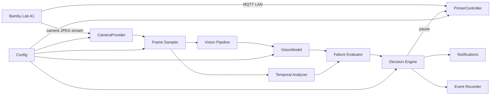

# bambu-ai-guard

Local AI failure detection and auto-pause monitor for the **Bambu Lab A1** 3D
printer, built for macOS / Apple Silicon. It watches the printer's built-in
camera, detects print failures (spaghetti, collapse, tower falling, object
displacement, air printing, blob), and can pause the printer automatically —
or run in **shadow mode** (detect + log only) so you can trust it before it
ever touches a print.

## 1. What it does

- Streams JPEG frames from the A1 camera over LAN (no cloud, no firmware changes).
- Runs a lightweight, swappable detection model (ONNX YOLO via onnxruntime,
  CoreML/CPU/MPS) on sampled frames.
- Combines per-frame detection with **temporal analysis** so a single weird
  frame never triggers a pause, but a consistent anomaly does.
- A **state machine** decides when a failure is confirmed and whether to pause.
- Records **evidence** (before/trigger/after + metadata) for every event.
- Serves a **local web UI** with live status, signals, and manual controls.
- Ships **CLI** commands and **dataset tooling** for fine-tuning.

## 2. Architecture



The business logic is decoupled from any specific Bambu library and any
specific AI model. Each is behind a small interface you can swap via config.

## 3. Bambu A1 support

The A1 (unlike X1) exposes:

- **Camera** — JPEG frames over a plain TLS socket on **port 6000**. A binary
  handshake (32-char `bblp` username + 32-char access code, little-endian,
  zero-padded) is followed by a continuous stream of JPEGs (~1 frame / 1–2 s).
  No RTSP, no HTTP/MJPEG.
- **Control / status** — MQTT over TLS on the printer's own broker,
  **port 8883** (self-signed cert). Username `bblp`, password = access code.
  Subscribe `device/{serial}/report`, publish `device/{serial}/request`
  (commands `pause`, `resume`, `stop`).

This project implements a **minimal in-repo client** for both channels
(`src/bambu_ai/camera/bambu.py`, `src/bambu_ai/printer/bambu.py`) so it has no
hard dependency on a specific third-party library, while remaining faithful to
the published protocol (the same protocol used by `bambu-connect` and the
`pybambu` library that ships in the Home Assistant Bambu Lab integration).
Both are swappable behind the `CameraProvider` / `PrinterController`
interfaces if you prefer a maintained library.

Everything runs on the LAN. No cloud, no firmware changes, no developer mode.
Bambu Handy / Bambu Studio continue to work alongside it.

## 4. Installation (macOS, Apple Silicon)

Requires [uv](https://docs.astral.sh/uv/) and Python 3.12+.

```bash
cd bambu-ai-guard
uv sync --all-extras          # core deps + onnxruntime + dev tools
uv run python scripts/download_model.py   # fetch YOLOv8n ONNX (~13 MB)
cp config.example.yaml config.yaml
cp .env.example .env            # fill in host / serial / access code
```

## 5. Configuration

`config.yaml` (gitignored) holds all settings. Values can reference env vars
(`${VAR}` or `${VAR:-default}`); secrets live in `.env` (also gitignored).
Never commit access code, serial, tokens, or private IPs.

Key sections: `printer` (host/serial/access_code), `camera`
(inference_fps), `vision` (provider/model/backend), `decision`
(thresholds), `actions` (auto_pause), `server`, `events`, `logging`.

## 6. How to get IP / serial / access code

- **IP** — Bambu Handy → printer → Settings → Network (Wi-Fi/Ethernet).
- **Serial** — printed on the label under the printer, or in Bambu Handy.
- **Access code** — Bambu Handy → printer → Settings (bottom of the About /
  security screen). It is the same code used for the camera handshake and the
  MQTT password.

## 7. Test the camera

```bash
uv run bambu-ai test-camera
# writes test_camera.jpg and prints the frame size
```

## 8. Test the printer connection

```bash
uv run bambu-ai test-printer
# prints current state + job name
uv run bambu-ai status
```

## 9. Shadow mode (default)

`actions.auto_pause: false` is the default and the safe starting point. In
**shadow mode** the system detects, scores, and records evidence, and logs
`would_pause` — but it **never touches the printer**. Run it for a while,
review the recorded events, and only enable auto-pause once you trust the
false-positive rate.

```bash
uv run bambu-ai monitor     # starts the monitor + local web UI
# open http://127.0.0.1:8710
```

## 10. Auto-pause

Set `actions.auto_pause: true` (or toggle in the UI). The decision engine then
actually calls `pause` on the printer — but **only after** re-verifying that
the printer is still printing and the anomaly is still present, and it records
the exact reason. A cooldown prevents repeated pausing on the same event.

```yaml
decision:
  pause_threshold: 0.90
  consecutive_frames: 3
  observation_window_seconds: 15
  cooldown_seconds: 60
actions:
  auto_pause: true
```

## 11. Model providers

`vision.provider` selects the backend; all are swappable via config:

| provider | notes |
| --- | --- |
| `onnx` | default. YOLOv8/YOLO11 ONNX via onnxruntime (CoreML/CPU/MPS). |
| `mock` | scripted results for tests / offline dev. |
| `remote_openai_compatible` | any OpenAI-compatible VLM endpoint (e.g. local vLLM/Ollama). Not for frame-by-frame on a Mac. |

## 12. Changing the model

Point `vision.model` at any YOLOv8/YOLO11 ONNX file (e.g. a fine-tuned
failure detector) and, if its class names differ, add a `vision.label_map`
JSON mapping class → guard signal (`spaghetti`, `blob`, `adhesion_loss`,
`collapse`, `air_printing`, `object`). Set `vision.backend` to `coreml`,
`cpu`, or `mps`. Re-run the benchmark to compare.

## 13. Benchmark

```bash
uv run bambu-ai benchmark-model
```

Reports backend, model, resolution, peak RAM, avg/p95 inference latency and
FPS, then recommends the backend with the best latency/simplicity tradeoff.
On the reference Mac (Apple Silicon, 24 GB) YOLOv8n @ 640 runs comfortably at
~30–40 fps on CPU and is fine at the 1–2 fps sampling the guard uses.

## 14. Dataset / fine-tuning

`tools/dataset/` provides the loop for training a dedicated failure detector:

```bash
python tools/dataset/extract_frames.py --src frames --dst dataset
python tools/dataset/make_yolo.py  --annotations ann.json --images dataset/images
python tools/dataset/split.py      --dataset dataset --val 0.1 --test 0.1
python tools/dataset/review_fp.py  --events events --min-conf 0.8
```

Layout: `dataset/{images,labels,events}` plus `train/val/test`. `review_fp.py`
lists recorded events and can flag false positives (`fp.json`) so they are
excluded from training.

## 15. Troubleshooting

- **`test-camera` times out** — confirm host/IP, access code, and that the
  printer is on. The camera uses port **6000**; the printer uses **8883**.
- **MQTT auth fails** — the access code is the MQTT password; double-check it.
- **No detections** — the stock model is COCO-trained, not failure-trained.
  It is sufficient for *temporal* displacement/collapse signals; for direct
  spaghetti/blob detection fine-tune a failure model (section 14).
- **High CPU** — lower `camera.inference_fps` (0.2–1 is usually enough).

## 16. Risks and limitations

- **Stock model is not failure-specific.** The bundled YOLOv8n detects generic
  objects. Displacement/collapse (temporal) works today; direct spaghetti/blob
  classification needs a fine-tuned failure model (tooling is included).
- **Air-printing is a heuristic.** It combines displacement + collapse signals
  and is intentionally conservative; it is not a full nozzle/geometry solver.
- **Single-camera, fixed viewpoint.** The A1 camera does not move; occlusions
  (tall prints) can hide the failure from its angle.
- **Latency of the A1 stream** (~1–2 s between frames) bounds how fast a
  collapse can be caught.
- **Auto-pause is destructive to a print** if mis-triggered — hence shadow mode
  by default and the re-verification + cooldown in the decision engine.
